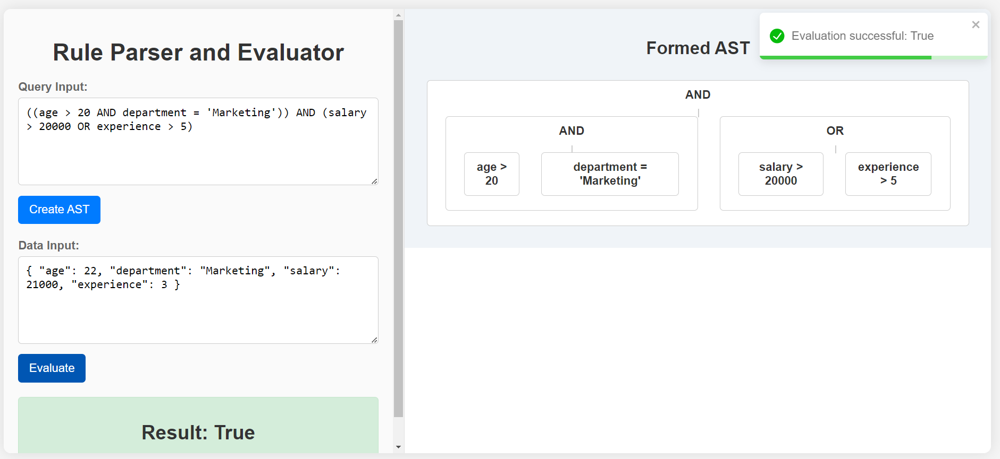
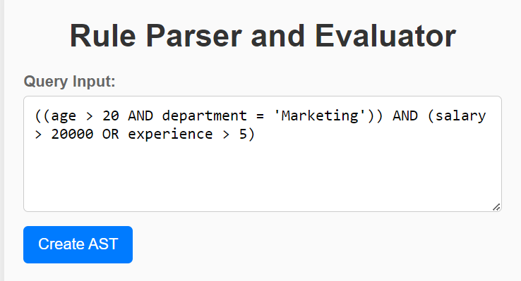
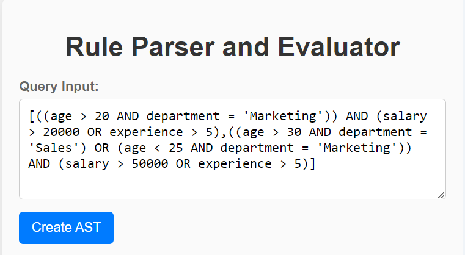
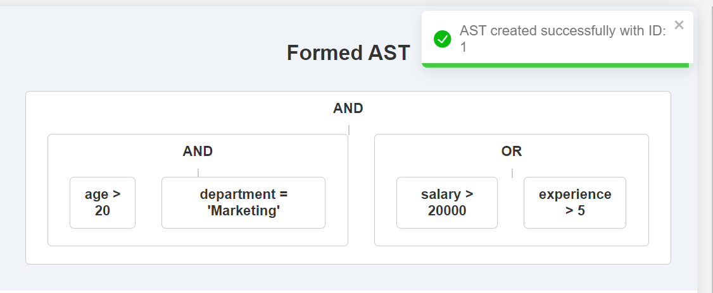
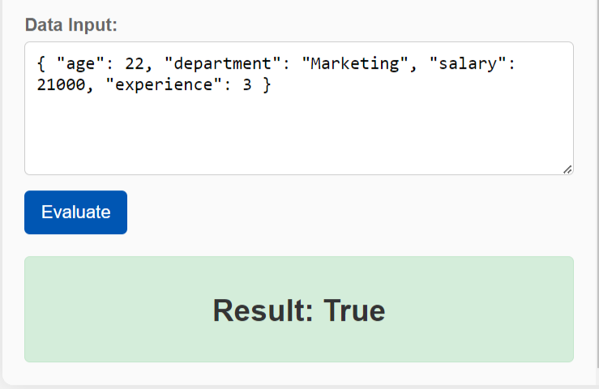
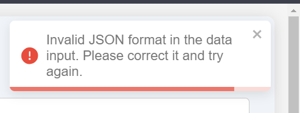

# Rule Engine Project

## 🔍 Query Processing and Validation Engine



## 🌟 Introduction

Welcome to the Rule Engine Project! This application processes queries to generate an Abstract Syntax Tree (AST) and validates JSON data against these queries. It supports both single and multiple queries, combining the latter based on the most frequent operator heuristic. The backend is implemented in Python using SQLite3 for the database, while the frontend is built with the MERN stack.

## 🌐 Features

- **Single Query Processing:** 
  - Generates an AST from a single query.
  - Example: 
    ```
    ((age > 20 AND department = 'Marketing')) AND (salary > 20000 OR experience > 5)
    ```
- **Multiple Query Processing:**
  - Combines multiple queries using a heuristic based on the most frequent operator and generates a combined AST.
  - Example: 
    ```
    [
        ((age > 20 AND department = 'Marketing')) AND (salary > 20000 OR experience > 5),
        ((age > 30 AND department = 'Sales') OR (age < 25 AND department = 'Marketing')) AND (salary > 50000 OR experience > 5)
    ]
    ```
- **JSON Data Validation:**
  - Checks if the input JSON data satisfies the rule defined by the query.
  - Example: 
    ```json
    { "age": 22, "department": "Marketing", "salary": 21000, "experience": 3 }
    ```
- **Interactive AST Display:** Provides an interactive visualization of the generated AST.


- **Error Handling:**
  - Alerts when Invalid JSON format in data.

## 🛠️ Technologies Used

- **Backend:**
  - **Python:** For processing and generating ASTs.
  - **Flask:** For creating the backend API.
  - **SQLite3:** For storing query and data records.
- **Frontend:**
  - **Express.js:** For backend server.
  - **React:** For building the frontend interface.
  - **Node.js:** For running the backend server.
- **Libraries and Tools:**
  - **Axios:** For making API requests.
  - **React-Toastify:** For displaying alerts and notifications.
  - **CSS:** For styling the application.


## 📸 Screenshots
*Single query processing with AST visualization.*
<br/>

<br/>

*Multiple queries processing and combined AST visualization.*
<br/>

<br/>

*AST formed.*
<br/>

<br/>

*JSON data validation result.*
<br/>

<br/>

*JSON data checks.*
<br/>

<br/>

## 📈 Data Processing

The system processes queries and JSON data through the following steps:
1. **Single Query Processing:** Generates an AST for a single query.
2. **Multiple Query Combination:** Combines multiple queries using the most frequent operator heuristic.
3. **JSON Data Validation:** Evaluates JSON data against the generated AST.

## 🚀 Getting Started

### Prerequisites

Make sure you have the following installed:
- Python
- Node.js

### Installation

  # 1. Clone the repository.
  
  ```
  git clone https://github.com/AbhinavBattu/Rule-Engine.git
  ```

  # 2. Running the backend.
  1. Go inside the server folder using (cd server)
  
  ```
  cd server
  ```
  2. Run the following command to install all the python requirements for the project( mentioned in the requirements file).
  
  ```
  pip install -r requirements.txt
  ```
  3. For running the server run the command.
  
  ```
  python app.py
  ```

  # 3. Running the frontend.
  1. Go inside the frontend folder.
  
  ```
  cd frontend
  ```
  2. In the frontend install all the node modules listed int the package.json file.
  
  ```
  npm i
  ```
  3. Run the (npm start) command to run the frontend.
  
  ```
  npm start
  ```

The app will be running at `http://localhost:3000` and the server at `http://localhost:5001`.

## 📬 Feedback and Contributions

We welcome feedback and contributions! Feel free to open issues or submit pull requests to help improve the website.
